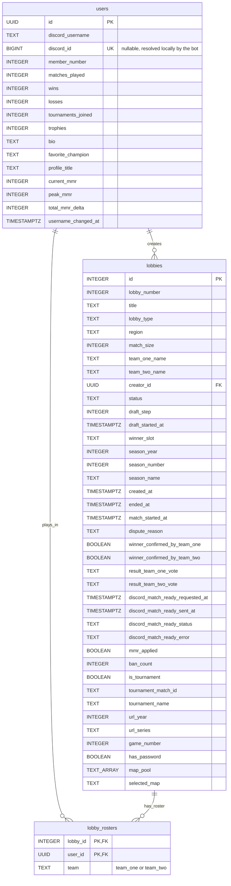

# WIP discord bot for battlevive website 

# preperation
requires browser and manual login, do this on client and manualy copy .env for prod
```bash
cd utils
```
fill up .env.example
```bash
mv .env.example .env
chmod +x init.sh
./init.sh
cd ..
```
# run
```bash
docker compose build
docker compose up -d
```
or 
```bash
podman compose build
podman compose up -d
```
# Schema



## Notes

- `users.id` and `lobbies.id` are upstream Supabase primary keys, kept as-is so joins and refresh-merges don't need a translation layer.
- `users.discord_id` is **bot-owned local state**, not part of the upstream payload. The refresh loop (`main.py`) must `UPDATE ... SET discord_username = ..., current_mmr = ...` etc. per-column, and never blanket-overwrite `discord_id` – see the earlier discussion on `refresh_loop` replacing `battlevive_users` wholesale.
- `team_one_roster` / `team_two_roster` (originally `List[str]` on the `Lobby` dataclass) are normalized into `lobby_rosters` rather than kept as Postgres array columns, so a query like "every lobby a given user played in" is a plain indexed join instead of an array-unnest scan.
- Not included yet, out of scope for this pass: guild config table (admin config command), leaderboard/active-lobbies message-tracking tables (channel ID → message ID). Add these once those commands are actually being built, per the earlier storage-design discussion.


