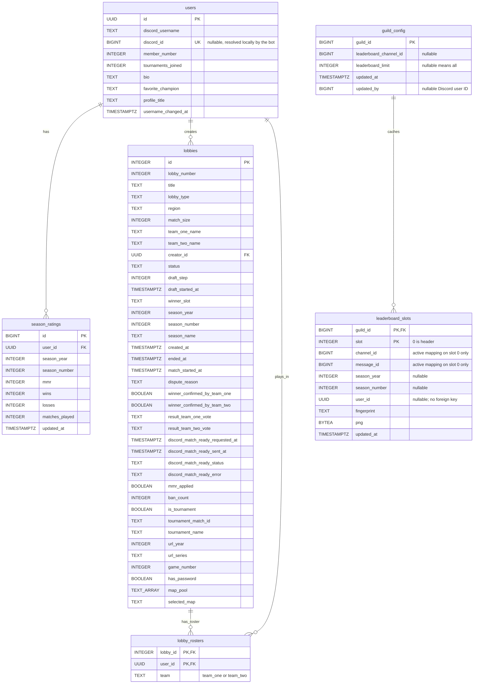

## Notes

- `users.id`, `lobbies.id`, and `season_ratings.id` are upstream Supabase primary keys, kept as-is.
- `users.discord_id` is **bot-owned local state**, not part of the upstream payload. Sync logic must never overwrite it.
- `season_ratings` is a separate upstream endpoint (`/season_ratings`), one row per user per season – `UNIQUE (user_id, season_year, season_number)`.
- `team_one_roster` / `team_two_roster` from the upstream `Lobby` payload are normalized into `lobby_rosters` rather than kept as array columns.
- Write order matters: `users` must be synced before `lobbies` and `season_ratings`, since both foreign-key into it.
- `guild_config` stores one row per Discord server. A nullable `leaderboard_channel_id` means the leaderboard destination is unset. A nullable `leaderboard_limit` displays all linked members with a rating; positive values cap the displayed places after Discord guild-member filtering.
- `updated_by` stores the Discord user ID that last changed the configuration and may be null for older/manual rows.
- `leaderboard_slots` stores one cached PNG and content fingerprint per fixed place. Slot `0` is the header and holds the active Discord message mapping; entry slots begin at `1` and keep their channel/message IDs null. The cached images are vertically combined into the single attachment edited on each visible leaderboard change.
- The current leaderboard season is the season belonging to the `season_ratings` row with the greatest `updated_at`. Rows in that season are ordered by `mmr DESC` with no additional tie-breaker.
- Native PostgreSQL triggers publish `leaderboard_changed` notifications for rating changes and changes to user Discord links or usernames. The bot also periodically reconciles as recovery for missed notifications.
